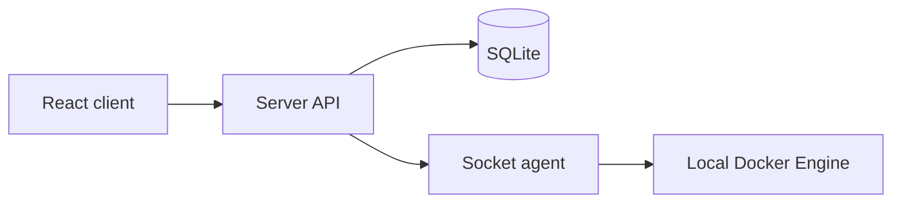

<div align="center">

# DOME

**Docker Orchestration & Management Engine**

*Your entire Docker infrastructure, under one roof.*

[](https://www.bestpractices.dev/projects/14152)

</div>

DOME is a self-hosted Docker infrastructure viewer. It discovers
containers through small Socket agents and presents them in a React Flow
diagram, grouped by Compose stack, with container state and mounted-volume
details.

> [!WARNING]
> DOME is under active development and is not production-ready before
> version 1.0. Breaking changes may occur.

> [!CAUTION]
> There is currently no authentication. Dome.Socket has privileged
> access to the Docker Engine. Deploy it only on a trusted private network and
> do not expose the Server or Socket APIs directly to the internet.

## Features

- Dashboard with registered Socket, container, running-container and
  unreachable-Socket counts
- Registration, editing and deletion of Docker hosts from the Sockets page
- Reachability status for every registered Socket
- A separate diagram tab for each registered Docker host
- Containers grouped by Docker Compose stack
- Container state and total mounted-volume size
- Volume name, mount destination, size and read-only/read-write details
- Multi-host support through one Socket agent per Docker host
- SQLite persistence with automatic EF Core migration at Server startup
- Published `linux/amd64` and `linux/arm64` container images

## Architecture



- The Client communicates only with Dome.Server.
- The Server stores Socket registrations and calls each Socket over HTTP using Refit.
- The Server never connects directly to a Docker Engine.
- Each Socket communicates only with the Docker Engine on its own host, using a
  Unix socket by default.

## Repository layout

```text
Dome.slnx
Directory.Build.props
Directory.Packages.props
global.json
src/
  Dome.Client/          React 19, TypeScript, Vite and React Flow
  Dome.Server/
    Dome.Api/           FastEndpoints HTTP API
    Dome.Business/      Application and orchestration logic
    Dome.Domain/        EF Core, SQLite and migrations
    Dome.Shared/        Server API contracts
  Dome.Socket/
    Dome.Socket.Api/    Docker integration and Socket HTTP API
    Dome.Socket.Contracts/  Refit interface and transport contracts
```

## Choose how to run DOME

| Mode | Best for | Requirements | Client URL |
| --- | --- | --- | --- |
| Rider | Developing and debugging individual services | Rider, .NET 10, Node.js 22+, Docker Engine | `http://localhost:5173` |
| Docker, local build | Testing the complete stack from source | Docker with Compose | `http://localhost:5200` |
| Docker, published images | Normal self-hosted use | Docker with Compose | `http://localhost:5200` |

## Run in JetBrains Rider

### Prerequisites

- A recent JetBrains Rider version with .NET 10 support
- [.NET 10 SDK](https://dotnet.microsoft.com/download/dotnet/10.0), using the
  version selected by `global.json`
- [Node.js 22 or later](https://nodejs.org/) and npm
- A running Docker Engine, such as Docker Desktop on macOS or Linux

Clone the repository and install the frontend dependencies:

```bash
git clone https://github.com/HomelabDocs/DOME.git
cd DOME
dotnet restore Dome.slnx
cd src/Dome.Client
npm ci
```

Return to the repository root and open `Dome.slnx` in Rider. If HTTPS
development certificates have not yet been configured, run:

```bash
dotnet dev-certs https --trust
```

The repository includes shared Rider run configurations under `.run`.

1. Ensure Docker Desktop or Docker Engine is running.
2. Select the `Local-Profile` run configuration.
3. Run or debug it.

`Local-Profile` starts all three development processes:

| Process | HTTP URL | HTTPS URL |
| --- | --- | --- |
| Client | `http://localhost:5173` | — |
| Server API and Swagger | `http://localhost:5100` | `https://localhost:7100` |
| Socket API and Swagger | `http://localhost:5110` | `https://localhost:7110` |

The Client's Vite development server proxies `/api` to the Server at
`http://localhost:5100`.

If Rider does not offer the multi-launch configuration, start these included
configurations individually:

1. `Dome.Server: https`
2. `Dome.Socket.Api: https`
3. `Dome.Client: npm run dev`

After startup, open [http://localhost:5173/sockets](http://localhost:5173/sockets),
choose **Register socket**, and enter:

| Field | Value |
| --- | --- |
| Name | `Local` |
| Address | `http://localhost:5110` |

Open **Diagrams** to view the local Docker containers.

## Run in Docker by building from source

This mode builds all three images from the checked-out source using
`dev.docker-compose.yml`.

```bash
git clone https://github.com/HomelabDocs/DOME.git
cd DOME
docker compose -f dev.docker-compose.yml up --build -d
```

Alternatively, open the solution in Rider and run the included `Local Docker`
configuration.

The stack exposes:

| Service | URL |
| --- | --- |
| Client | `http://localhost:5200` |
| Server API and Swagger | `http://localhost:5100` |
| Socket API and Swagger | `http://localhost:5110` |

Open [http://localhost:5200/sockets](http://localhost:5200/sockets), register a
Socket named `Local`, and use this address:

```text
http://socket:8080
```

Use the Compose service address—not `localhost:5110`—because the Server is
also running inside Docker. From the Server container, `localhost` refers to the
Server container itself.

View logs with:

```bash
docker compose -f dev.docker-compose.yml logs -f
```

Stop the locally built stack without removing its database volume:

```bash
docker compose -f dev.docker-compose.yml down
```

## Run in Docker with published images

The root `docker-compose.yml` uses the public images from GitHub Container
Registry:

| Service | Image |
| --- | --- |
| Server | `ghcr.io/homelabdocs/server:latest` |
| Socket | `ghcr.io/homelabdocs/socket:latest` |
| Client | `ghcr.io/homelabdocs/client:latest` |

Clone or download the repository, then run:

```bash
docker compose pull
docker compose up -d
```

Open [http://localhost:5200/sockets](http://localhost:5200/sockets) and register:

| Field | Value |
| --- | --- |
| Name | `Local` |
| Address | `http://socket:8080` |

Stable releases publish the exact semantic version, `MAJOR.MINOR`, `MAJOR` and
`latest` tags. Pre-releases publish only their exact version tag. For a
repeatable installation, replace `latest` in all three image references with
the same exact release version.

To update an installation using published images:

```bash
docker compose pull
docker compose up -d
```

## Connect multiple Docker hosts

Run Dome.Socket on every host whose containers should be displayed. Each
Socket needs access to that host's local Docker Unix socket and must be reachable
from Dome.Server over HTTP or HTTPS.

Register every Socket from the Sockets page using a unique name and an address
that is reachable from the Server. The name becomes the device label and diagram
tab. A green status indicator means the Server can reach the Socket health
endpoint.

## Configuration

ASP.NET Core configuration can be supplied through `appsettings.json` or
environment variables.

| Component | Setting | Environment variable | Default |
| --- | --- | --- | --- |
| Server | `ConnectionStrings:Dome` | `ConnectionStrings__Dome` | Local app-data path in Development; `/var/lib/dome/dome.db` otherwise |
| Socket | `Docker:Endpoint` | `Docker__Endpoint` | `unix:///var/run/docker.sock` |
| Compose host | Docker socket mount source | `DOCKER_SOCKET_PATH` | `/var/run/docker.sock` |

Only Unix Docker sockets are currently supported. When the Docker socket is not
located at `/var/run/docker.sock`, set `DOCKER_SOCKET_PATH` before starting
Compose. For example:

```bash
export DOCKER_SOCKET_PATH=/path/to/docker.sock
docker compose up -d
```

## Persistence and backups

In Docker, SQLite data is stored in the named volume `dome-data` at:

```text
/var/lib/dome/dome.db
```

The volume survives container recreation and image updates. Do not run
`docker compose down -v` unless you intentionally want to delete the database.

For a host-visible data directory, replace the named-volume mount in the
Compose file with a bind mount such as:

```yaml
volumes:
  - ./data:/var/lib/dome
```

Back up the complete data directory while ensuring the SQLite database is in a
consistent state.

For local development, the database is stored under the operating system's
local application-data directory:

| Platform | Default path |
| --- | --- |
| Windows | `%LOCALAPPDATA%/DOME/dome.db` |
| Linux/macOS | `$HOME/.local/share/DOME/dome.db` |

## Development commands

Run the same core validation used by CI:

```bash
dotnet restore Dome.slnx
dotnet build Dome.slnx --configuration Release --no-restore
dotnet test Dome.slnx --configuration Release --no-build
```

Validate the Client:

```bash
cd src/Dome.Client
npm ci --ignore-scripts
npm run lint
npm run build
```

Create an EF Core migration from the repository root:

```bash
dotnet ef migrations add <Name> \
  --project src/Dome.Server/Dome.Domain \
  --startup-project src/Dome.Server/Dome.Domain
```

## Troubleshooting

### The Socket is shown as unreachable

- Confirm the Socket API is running and its `/api/health` endpoint responds.
- Confirm the registered address is reachable from the Server's environment.
- For the full Compose stack, use `http://socket:8080`.
- For a fully local Rider run, use `http://localhost:5110`.
- Check firewalls and routing when the Socket runs on another host.

### The Socket cannot list containers

- Confirm Docker Engine is running.
- Confirm the Socket process can access the configured Unix socket.
- In Compose, confirm the Docker socket is mounted into the `socket` container.
- On Linux, check the permissions of `/var/run/docker.sock`.

### The Client cannot reach the Server

- In Rider mode, confirm the Server is listening on `http://localhost:5100`.
- In Docker mode, confirm all three Compose services are running with
  `docker compose ps`.
- Inspect Server and Client logs for startup or proxy errors.

### HTTPS fails during local development

Recreate and trust the ASP.NET Core development certificate:

```bash
dotnet dev-certs https --clean
dotnet dev-certs https --trust
```

Restart Rider after updating the certificate.

## Current limitations

- No user authentication or authorization
- No TLS or authentication between Server and Socket
- No background synchronization or Docker event stream
- No Windows named-pipe support
- No remote Docker Engine `tcp://` support
- Networks and arbitrary container-to-container dependencies are not yet visualized

## Contributing

Feedback, bug reports and feature requests are welcome through
[GitHub Issues](https://github.com/HomelabDocs/Dome/issues).

Before contributing, read [AGENTS.md](AGENTS.md) and
[Instructions.md](Instructions.md), then ensure the relevant builds and tests
pass.
